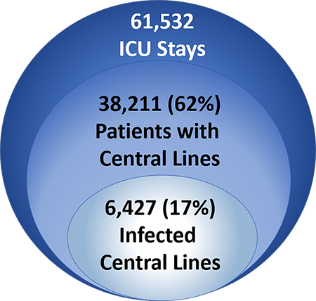
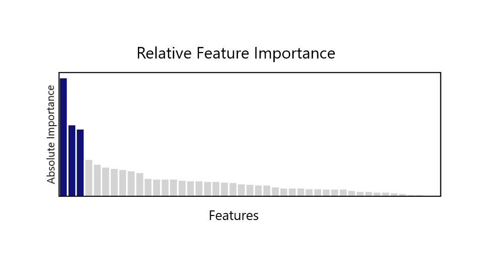
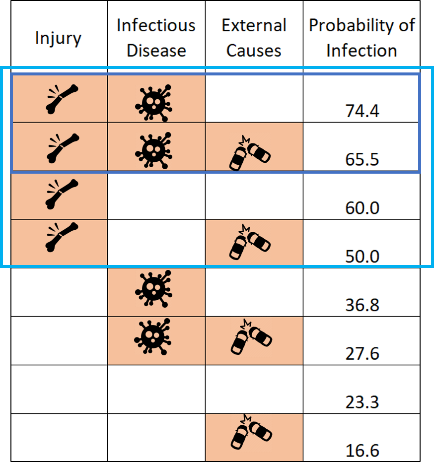

# Predicting central line infections in the ICU using the MIMIC-III database

## Motivation: 
Approximately half of all patients in critical care settings will need a central line for their care 1. Central lines are catheters placed into a large vein near the center of the body and are used for delivering medications that can be damaging to peripheral veins, for long-term administration of antibiotics, pain medications, nutrition, and/or chemotherapy, and for patients that require frequent blood draws or frequent IV access. However, central lines can cause serious adverse effects including pneumothorax, an abnormal collection of air in the space between the lung and chest wall, thrombosis, blood clots, and bloodstream infections. Bloodstream infections are easily the most expensive healthcare-associated infection costing between $17,000 and $95,000 per case 2. It is estimated that per year 250,000 cases of central line-associated bloodstream infections occur, with a mortality rate of 10% 3.  Fortunately, however, these infections are preventable with proper aseptic techniques, surveillance, and maintenance. A recent study recently showed that the nurse-to-patient ratio was the strongest predictor in compliance to proper infection prevention guidelines. However, hospitals often do not have enough nurses so that every patient has a dedicated nurse. Thus, I aimed to predict which patients were at high risk of developing central line-associated bloodstream infections and what factors contributed to this risk. Knowing this, hospital staff could prioritize dedicated nurses for high-risk patients so that infections could be avoided. 

## Data:
MIMIC-III is a publicly available critical care database containing de-identified information from over 40,000 patients who stayed at the Beth Israel Deaconess Medical Center between 2001 and 2012. The database includes patient demographic information, admittance and discharge times, diagnostic and billing codes, laboratory test results, procedures, medications, caregiver notes, imaging reports, mortality (in and out of the hospital) as well as vital sign measurements collected per hour at the bedside. While care has been taken to de-identify this data, additional considerations are needed when working with this data. Thus, to access the database, I first completed the required data research course and signed the Data Use Agreement (more information about how to access this dataset can be found here: https://mimic.physionet.org/gettingstarted/access/). Due to the nature of this data, I will not be able to share any raw data on github. 
The data is stored as postgreSQL database in 26 tables. The schema for the database can be found on the MIMIC website, linked here: https://mimic.physionet.org/mimictables/. I worked with this data through a local version of the PostgreSQL database that I set up on AWS. 

## Data Processing, Cleaning, and Feature Engineering: 
Of the 26 tables available in the MIMIC-III dataset, I worked with the following: 
* ADMISSIONS
*	DIAGNOSES_ICD
*	ICUSTAYS
*	PATIENTS
*	PROCEDUREEVENTS_MV

I started my project by merging the PATIENTS, ICUSTAYS, and ADMISSIONS tables together on icustay_id which is a unique identifier in all 3 tables. I nicknamed the resulting table “PIA”. This table includes demographic information as well as administrative information about the patients’ stays in the ICU. Next, since, by definition, CLABSIs could only develop in patients who had central lines, I filtered my dataset to include only these patients. I utilized the following SQL script to extract central line information from the PROCEDUREEVENTS_MV table:  https://github.com/MIT-LCP/mimic-code/edit/master/concepts/durations/central-line-durations.sql. Subsequently, I merged my “PIA” table onto my central line durations table (left join on icustay_id). Lastly, after cleaning and engineering the diagnoses codes from the DIAGNOSES_ICD table, I merged this information onto my PIA + Central Line Durations table (left join on hadm_id). 

*Figure 1. The MIMIC-III Database includes information from 61,532 unique ICU stays. In 62% of these stays, patients received central lines. Within patients who received central lines, 17% (6,427 patients) of these central lines became infected.* 

Of note, the MIMIC-III database includes patient stays at 6 different ICUs: CSRU, CCU, MICU, SICU, TSICU, and NICU. I removed NICU entries as these patients are considerably different from those staying in other divisions.  

I created several new features including: 
*	Time spent in the hospital before being admitted to the ICU
*	Time spent in the emergency department 
*	Age (in years) 

I grouped some features into a smaller number of categories: 
*	Marital status: 7 into 2 bins
*	Location prior to admission: 9 into 5 bins
*	Language: 75 into 2 bins (with the assumption that null values were patients speaking English)
*	Religion: 20 into 2 bins (with the caveat that the information provided only allows the distinction between religions and unspecified not religious and non-religious) 
*	Ethnicity: 41 into 5 bins
*	Diagnostic codes: 6984 into 22 bins

Diagnosis codes were by far the most challenging to clean. I created a lookup table for the codes using ICD-9 pre-defined categories (https://en.wikipedia.org/wiki/List_of_ICD-9_codes). I classified CLABSIs using the following ICD-9 codes identified via literature searches: 038.9, 995.91, 995.92, 999.31, 999.32, 999.33. I also included E and V codes, external causes of injury and supplementary classification and grouped these in their own column. It is important to note that each patient had several (up to 13 unique) diagnostic codes. As such each diagnostic feature is independent of the others. 

## Algorithms: 
I started my project with random forest’s feature importance scores (determined through recursive feature elimination and model retraining) to get an idea of which features to include in my model. Surprisingly, I discovered that just three features provided the bulk of predictive power. 

*Figure 2. Relative absolute importance of each of 45 features determined by comparing baseline random forest out of bag sample scores with oob_scores from models missing a column each.  Blue indicates the three most prominent features: injury and poisoning, infectious diseases, and external causes of injury.* 

As only three features would lend itself well to creating a general rule that could be used to make policy decisions in healthcare settings, I continued with only these three features. They are: injury and poisoning, infectious diseases, and external causes of injury (ICD-9 codes: 800-999, 001-139, and E, respectively). I then compared five different classification models: Logistic Regression, Random Forest, Naïve Bayes, Support Vector Machine, and K-nearest Neighbor. Of note, prior to running models, I balanced the classes with random over sampler and used standard scalar. When comparing models on the ROC curve, it was apparent that logistic regression and random forest showed the best performance and were comparable to each other. I chose to use Logistic Regression as I wanted to determine the probabilities of infection for patients and logistic regression has better probability calibration. 

*Figure 3. ROC Curve for classification models on top 3 features only. Scores indicate area under the curve (AUC).* 

Since my model had only 3 features, and each feature was binary, there was only eight possible combinations that could exist in my data. Thus, I fed these combinations to my model as a test set to map the probability of infection to each scenario. I determined that the scenarios with the highest probabilities of infection were when patients were diagnosed with both injury and infectious disease. Focusing on patients with these diagnoses, in my test set, I would capture 42% of all CLABSIs. While promising, over half of infections are not identified with these criteria. Instead, if I expand the population to include patients with a diagnosis of injury (instead of injury + infectious disease), then I was able to capture 80% of all CLABSIs (recall of .8). This general rule would result in precision of 67%. 

*Figure 4. Diagram showing the eight possible combinations of my three binary features and the probabilities of infection associated with each scenario. The dark blue box highlights the scenarios with the highest probabilities of infection (correlating with 42% recall) and the light blue box encapsulates a larger population correlating with 80% recall.* 

## Conclusions: 
Based on my data, my recommendation for healthcare professionals at Beth Israel Deaconess Medical Center would be to prioritize the care of patients with central lines as well as a diagnosis of injury or poisoning. One way of doing this would be to prioritize assigning these patients dedicated nurses (1:1 nurse-to-patient ratio) as infection rates have been shown to decrease in these situations. Assuming patients receiving prioritized care did not develop infections, had this rule been implemented at Beth Israel from 2001 to 2012, 80% (5,141) infections would have been avoided. Assuming infections occurred equally over the eleven years in the study, this breaks down to 467 patients per year. With an average cost of $46,000 per case, this would result in $21.5 million dollars saved to the healthcare system in one year for this hospital alone. 

## Tools:
*	Jupyter Notebooks
*	Pandas, Pickles, Seaborn, Scikit learn 
*	AWS
* PostgreSQL 
* DataGrip (GUI for relational databases)

## References:
1.	https://www.ncbi.nlm.nih.gov/pubmed/14700410
2.	https://www.ahrq.gov/professionals/quality-patient-safety/pfp/haccost2017-results.html 
3.	https://www.ncbi.nlm.nih.gov/pubmed/27481738/
